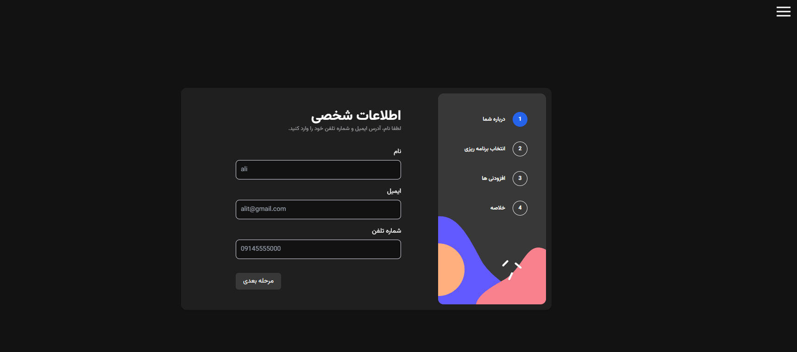

# Todo App

(./public/images/multi-step-light.png)

## Welcome! 👋

This app is a subscription purchase.

## Getting Started

To get started with the app, clone the repo and then install the necessary dependencies:

## Clone app

```open project
git clone https://github.com/ali-tz-2004/multi-step.git
```

## Run app

install npm:

```npm
npm install
```

The app will be served at http://localhost:3000.

Features
With this app, you can:

look at previous steps and change them at any time.
make your theme dark or light.
choose your language.

Contributing
Contributions are welcome! Please feel free to submit a pull request or open an issue if you find a bug or have a suggestion for improvement.
Thank you ❤

Acknowledgments
This app was built with the help of react, typescript, tailwind css
